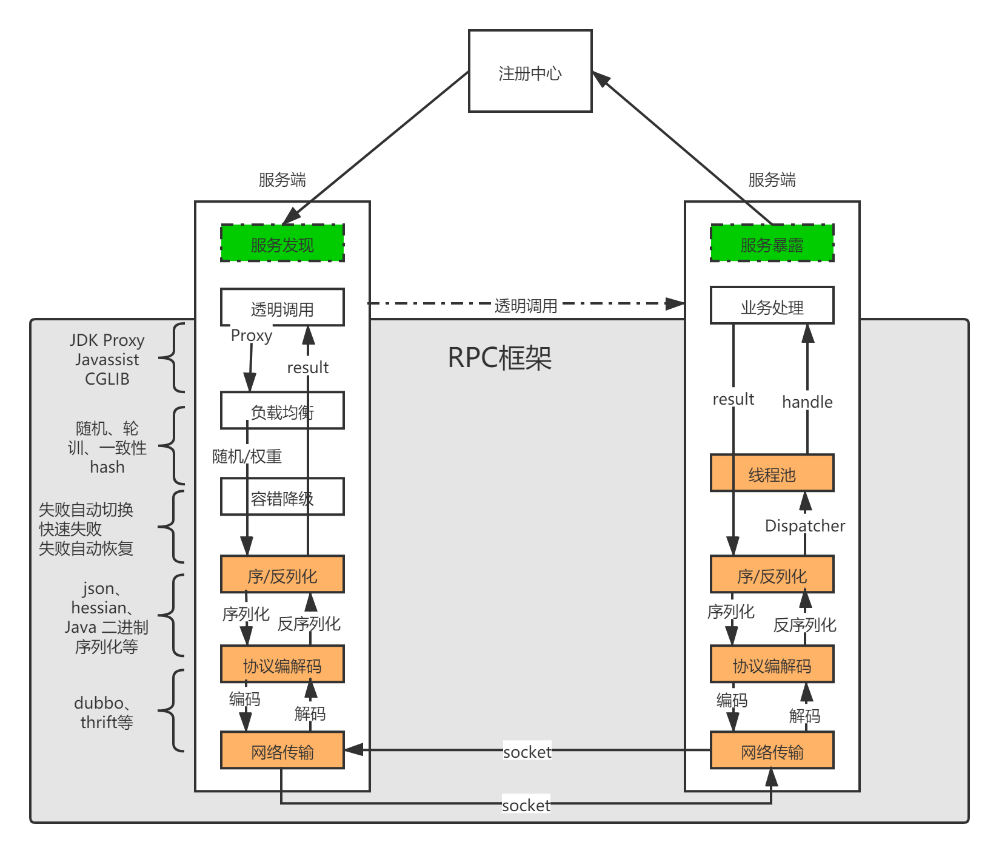

# myRPC
Remote Procedure Call

调用远程计算机上的服务，就像调用本地服务一样。

- [x] **实现BIO方式的RPC；**
- [x] **使用 Netty（基于 NIO）替代 BIO 实现网络传输；**
- [x] **实现自定义编码解码器，避免Java序列化⽅式解码编码速度较低和TCP粘包和拆包问题；**
- [x] **使用 Zookeeper 管理相关服务地址信息；**
- [x] **客户端调用远程服务的时候进行负载均衡** ：调用服务的时候，
  从很多服务地址中根据相应的负载均衡算法选取一个服务地址。实现了随机、轮询、一致性哈希算法。

- [x] **To Be Continue......**
